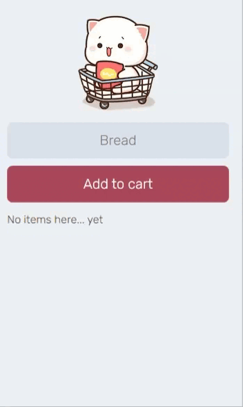

# Cat-PWA-App
## Visualation of the App
### Check it out: [The Link](https://cat-pwa-app-pj.netlify.app/)



### Description: Create first PWA app using real time database with Firebase. It is called as shopping list. The app features include:
```bash
- User can add or remove items on Firebase databse
- When user double clicks any item, item is deleted
- User can add this application on homescreen and use it as a mobile app
```
### What I Learned ?
```bash
- Firebase: onValue, push(), remove(), getDatabase, ref(), snapshots
- Favicon converter 
- Web Application Manifest
- user-select
-Object.values(), Object.keys()
```

